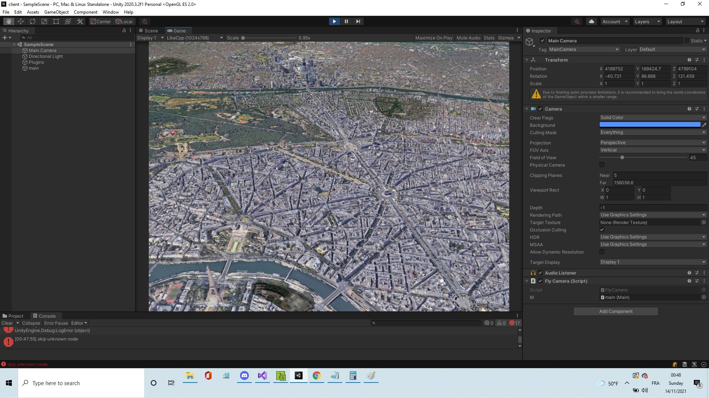

# unity-google-earth

Google 3D Earth Satellite rendering

This work is still in progress but the retro-engineering part is finished

Acknowledgment to https://github.com/retroplasma/earth-reverse-engineering for having done the same thing in C++ (I took heavy inspiration from their work)
